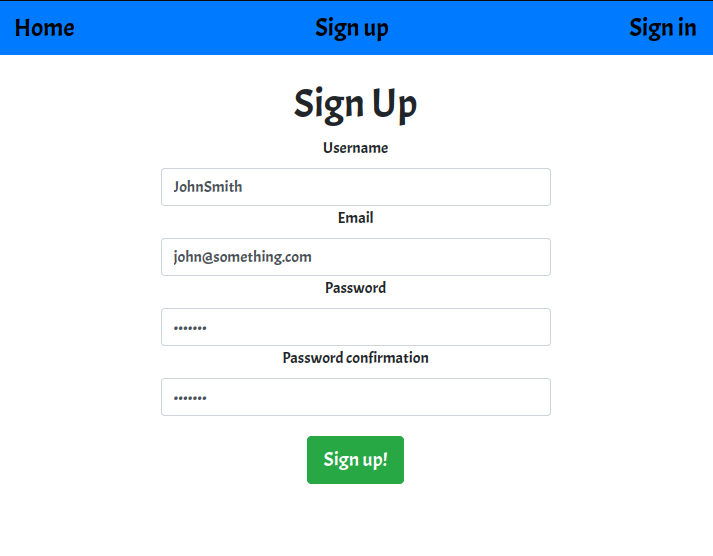
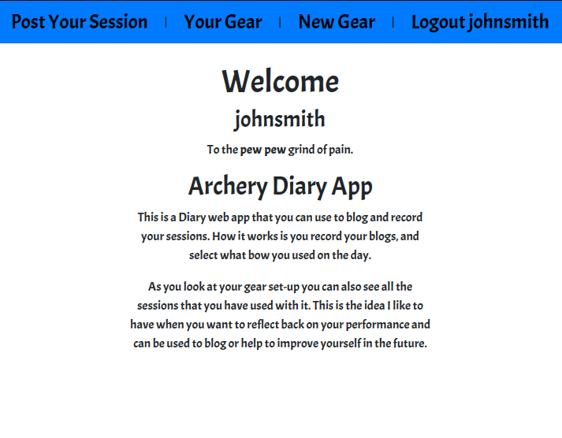
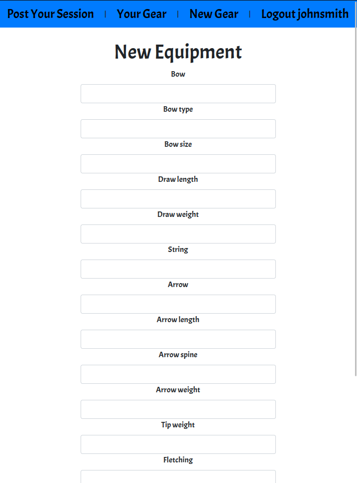
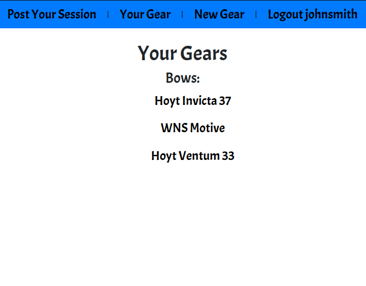
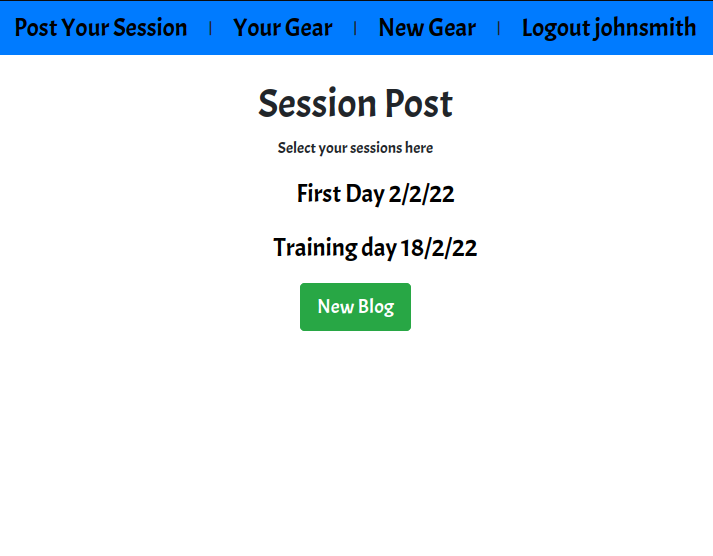
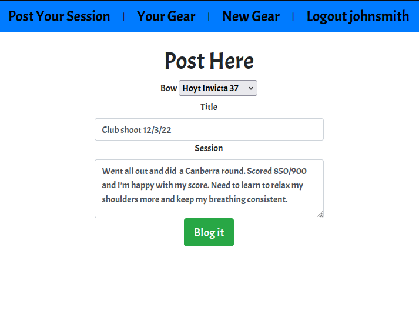
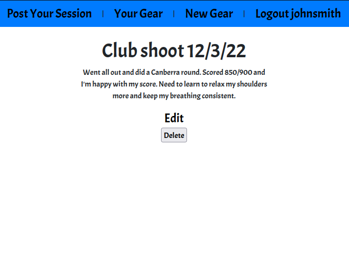
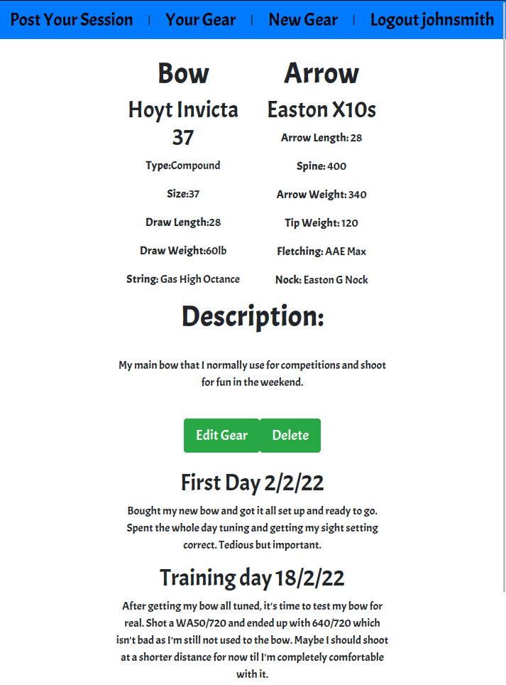

# General Info

This project I developed an Archery Diary Blog and keeping records of my session and progressions. The idea is you use when an archer done their training sessions they can blog out what they done that day, how they felt, what they did great in and where to improve on. 

# Motivation

I originally wanted to do a scoring app that can store your total score session like any club shoot/qualification rounds that keeps your data of scores along with your bow gear specs. After some time I realise that the scoring app alone will take more more than a week than I expected so I decided to make a simple blog session app instead.

# Link to my website:

I recommend to somewhat treat it like a mobile web application. So feel free to check out my
[Diary App](https://archer-session-diaries.fly.dev/).

### To Login
```
Email : john@something.com
Password : chicken
```

# Technologies

- Ruby on Rails  v5.2.8.1
- PostgreSQL
- Bootstrap 4.6
- Fly

# My Learning Experience

### Day 0 
Thinking of a concept and models of a archery scoring app and how the user will use it

### Day 1
 Had to propose my plan on how to build it and created a view map and a view page map of how I'm gonna build it.

### Day 2 
Took some time thinking of a model and when building it I keep failing to build the basic structure so I decided to go back to square one and which I decided to head down to the range and actually did a scoring round.

### Day 3 
Had a good sense of understanding the structure and model I had to build and had to get on it. Started by developing the login use accounts and set up the archery gear section.
### Day 4
Struggled to build a full functioning site and learnt to deploy the site using heroku. End of the day got the site and the logins working.

### Day 5
Coded the functions to get my app working but I had alot of trouble trying to applying it to rails along with how to store the date with it. With the big help from Lodan it turns out I had to create another model or 2 which I had 3 before and now I may have to build 4-5 models.

### Day 6
After many struggles to get scoring app working I decided to put this in the side as I will not get it done by the end of the week. I have decided instead to create a diary website instead and keep it simple as a 3 models.

### Day 7
I have all the necessary functions working and how my site going as it needs to go. I have struggled alot with getting the links to navigate between the associations of both the equipment gears and the blog post together. After some Lodan help I had it working until I deployed it...

### Day 8
Had alot fo help getting some of my deployment working. I can't seem to figure out my new and show pages as it keeps crashing. I didn't know how to actually log into the terminal of Heroku to get this running and after with the help of Joel and Lodan once again I had to rollback, migrate and reset my deployment finally worked. Had learnt more about Heroku and fixing errors than any other days I've done.

### Day 9
Done everything that I can on this project and it's all about the README and CSS now so I'll at least make it pretty. <3

# Credits

I like really thank Lodan and Joel for helping me out in this project as I learnt a hell lot and not be able to do this alone. 

# How to use

Sign up like so:



At the Homepage



Check out your gears or make a new gear




Go to your post sessions then select New Blog



Make a new blog and don't foget to select your bow.

<!--  -->

<!--  -->


And you can also see your post along with your gear profile

<!--  -->

